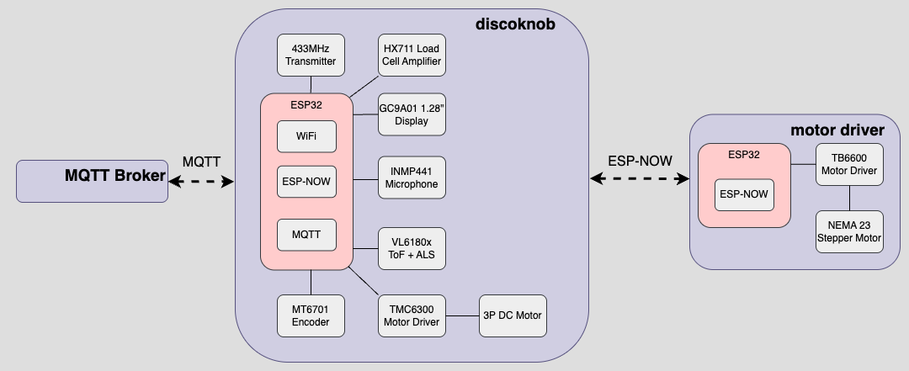
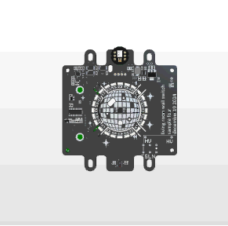

# overview
## introduction
Discoknob is a respin of [Seedlabs' Smart Knob Dev Kit](https://github.com/SeedLabs-it/smartknob-firmware), which is built on top of [ScottBez](https://github.com/scottbez1)'s original [smart knob](https://github.com/scottbez1/smartknob/), and repackaged to fit into a doublegang outlet/switchbox. From a software standpoint, it is largely a stripped down from Seedlabs' Dev Kit 0.1 version, and shares much of the same core hardware. Discoknob adds a couple capabilities to help control the discoball in our living room, and to control a some other connected devices.

#### discoknob demo

## motivation 
I came across ScottBez's original Smart Knob project around when it came out and thought it was a super cool idea. It wasn't until years later that I considered building my own, and found the Seedlab's Dev Kit version that leveled up the original design. The concept of "apps" felt very intuitive and their framework made it easy to add new ones.

I decided that if I were to build my own, I'd want to really lean into the Nest-like experience, and then also give it a dedicated purpose in our mostly unconnected/unautomated apartment.

## design
The main design goals were to:
1. Drive the discoball in our living room, specifically spin the ball motor and control the spotlights
2. Wall mount the device to replace an existing doublegang outlet/switchbox

### discoball driver
For the first goal, I needed to figure out how wirelessly do both of these things. The [two spotlights](https://a.co/d/75LlCRr) are from some non-descript brand that came with some generic remotes. Upon peeling back the overlay on the remote, a PCB serial code lookup revealed the universally seen [433MHz remote](https://fcc.report/FCC-ID/2AUSN-LXZK1021/4490455.pdf). This led me to a successive Amazon purchase of some [generic 433MHz receiver and transmitter modules](https://a.co/d/hEBihKS), and a hunt to decode the radio signals.

Upon powering a receiver and probing the RX pin with a logic analyzer, I was able to distinguish the on-off-key (OOK) signal and record each remote button's 25 bit sequence. These were then passed back through a transmitter using the RCSwitch library at a 500us pulsewidth which successfully spoofed the remote.

The discoball motor was a separate challenge - to spin the motor I would need something directly driving it. I had a leftover stepper motor and stepper motor driver from the Wallflower's NeonRotator builds, so I paired those with an ESP32C3 loaded with a barebones FW build that listened for ESP-NOW messages and outputted a PWM/direction line to the driver, and threw it all into an enclosure. It's overkill but it serves it's purpose.

<!-- 

discoball mount
 -->

<!-- 
 -->

### wall mounting
To make this work in a gangbox, I needed to figure out how to power the device *and* make it fit within the confines of the box. I was able to find a [120VAC/5VDC converter](https://www.digikey.com/en/products/detail/recom-power/RAC15-05SK/9356902) with a small enough footprint, and with a bit of component reshuffling, I was able to pack it all in. The final result is a bit bulky, also because I decided to stack a full DevKitC-1 onto the board rather than use a standalone ESP32S3 WROOM module. It fits and at least has provides a bit of component symmetry on the rear side.

#### discoknob fitment

### hw architecture
Again, most of the architecture is recycled based off of the original designs, but here is the full system at an overview:

#### discoknob architecture diagram

#### final assembly
To complete the look, I designed a faceplate to sit over the knob. The resin print with a layer of white spray paint helped it blend in nicely. Here's the final result:

#### discoknob exploded view

discoknob board model

[discoknob schematic](media/discoknob_schematic.pdf)

### changelist from Seedlabs' Dev Kit
Here's an overview of the HW differences from Seedlabs' Dev Kit:
- ESP32S3-DevKitC-1 N8R8 mounted directly on board instead of standalone module
- 433MHz transmitter added for RF capabilities
- VL6180x used for ALS and ToF sensing
- INMP441 microphone added for audio input
- 24 side-firing SK6812 RGB LEDs used
- XIAO Round Display instead of FPC-connected screen

### sw architecture
As mentioned, discoknob's software is a neutered version of the Dev Kit 0.1's software. I gutted a couple of things, namely:
- Most of the apps
- The onboarding flow
- HASS (Home Assistant) connectivity 

The intent was to keep it lean in terms of getting the device onto my WiFi and connected to my MQTT broker. The demo apps were interesting but didn't align with how I envisioned using this. I also added a simple remote lockout feature to ensure that only one web client is able to send commands to the discoknob at a time. My only other addition was integrating in some [smart switches](https://www.athom.tech/blank-1/us-v2-plug-for-esphome) which are accessible via MQTT with some minor reconfiguration. This was an added novelty to turn on and off some lights that are otherwise hard to reach, and leveraged the existing "light_switch" app to implement them.
